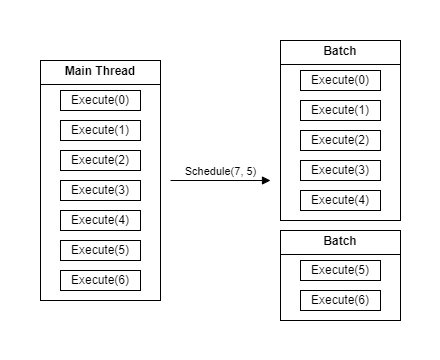

# Task Driven Threading

`Unity 2022.3.12f1`
`.NET Standard 2.1`
`C# 9.0`

Task Driven Threading is a simple, yet lightweight alternative to 
[Unity's Job System](https://docs.unity3d.com/Manual/JobSystem.html) that lets you execute your code on other threads, 
so your game can run smoothly and without issues. This package includes a wide selection of different ways to set up 
your threads as tasks that can execute your code in any way you want, with a multitude of handy tools to keep track of 
the threads.

## Features

- Multiple interfaces to implement, while still keeping you able to perform inheritance.
  - Task: For your simple threading needs, with or without return typing.
  - Multitask: For those who have a lot of repeating work, now able to be done in parallel. Also includes return typing.
  - Routine: Keep your thread running with reoccurring work at a specific interval.
- A special tracker to keep track of any task in progress with handy events that will notify you when it is done.
- Task dependency. Create long chains of task in parallel or depended upon each other.
- Timeout control, to combat the worst kind of threads. Specify a time limit for your tasks to keep them from spiraling 
  out of control.

## Prerequisites

Task Driven Threading, like any multithreading solution, needs to be used carefully in a specific scenario with a
logical use case. Usually, the [Unity's Job System](https://docs.unity3d.com/Manual/JobSystem.html) is good enough for
multithreading, but can be limiting. Use this package only when Unity's Job System isn't working for you and you 
satisfy one of the following one or more of the following requirements:

1. Do you have to run code in the background?
2. Does the code take moderate to very long to execute?
3. Do you have many small pieces of code that, together, take a moderate to very long to execute?

## Getting started

### Creating a task

The first step to create a thread is to define its work. This can be done by implementing one of the many interfaces 
this package includes. For this example, we will use a task and its return type equivalent. This generic version is 
especially useful to create ways to [handle](#keeping-track-of-your-threads) the results of your thread in asynchronous 
way.

```csharp
using Incantium.TDT;

// Task adding two floating point values together
public class MyTask : Task<int>
{
    public int a;
    public int b;
    
    public int Execute() 
    {
        return a + b;
    }
}
```

### Starting a task

After the implementation of your task, it is possible to execute these upon their own threads. There are multiple 
different ways to start a task, even with [task dependencies](#task-dependencies) included. For this example, we will 
use the simpler variant compatible with the task as described above.

```csharp
using Incantium.TDT;

public class Main
{
    public void Method() 
    {
        // Create a new task
        var task = new MyTask
        {
            a = 5,
            b = 2
        };
        
        // Start the task
        var tracker = task.Schedule();
    }
}
```

### Keeping track of your threads

Each scheduled task comes with its own tracker. This tracker is used to keep track of the task you just started. Because
every task is executed on its own thread, it is impossible to know when it will be completed. A tracker will let you 
handle the completion of your tasks in an asynchronous way.

```csharp
using Incantium.TDT;

public class Main
{
    public void Method() 
    {
        ...
        
        // Handle the task completion
        tracker.success += () => DoSomething();
    }
}
```

The tracker has multiple events that are triggered when your task has completed. Here below is the order of events that 
are triggered when your task has completed:

1. Exception: Returns a list of exceptions when any has occured.
2. Success: Triggers when the task has completed, even if some exceptions have occured.
3. Result: Unique to tasks with a return value. Returns the return value when the task has completed.

### Multitasking

It is quite easy to create a task that is run for multiple likewise tasks. To create such a task, you need to implement
the multitask interface or its return type equivalent.

```csharp
public class MyMutiTask : MultiTask<int>
{
    public List<int> input;
    public int multiplier;
    
    public int Execute(int i) 
    {
        return input[i] * b;
    }
}
```

Scheduling a multitask is almost the same as [scheduling a single task](#starting-a-task). However, multitasks need to 
know how many times it has to be executed. This can be done by assigning a specific value, but can also be done by 
inserting any list into the scheduler for a more dynamic approach. This is especially powerful with 
[task dependencies](#task-dependencies), as dynamic amounts are resolved when the dependency is resolved, not at the 
moment of scheduling.

> Note: The return typing of the result event of the tracker for a return multitask is always an array of your chosen
> typing.

### Batching

Batching is the act of taking multiple single tasks of a [multitask](#multitasking) together. This is done to not create
endless threads, which do have overhead for each started. With batching, each batch will take on a couple of single 
tasks. Here below is an example how batching works with a multitask with seven single tasks, split into batches of a 
maximum of 5:



### Task dependencies

This package allows for chaining multiple tasks after each other by attaching another task. This act will let you
activate a task later, only after another task has completed. For a full demo of this feature, see this 
[test](Tests/Scenarios/DemonstrationTest.cs). Here below is a shorter version how dependencies are used:

```csharp
public class Main
{
    public void Method() 
    {
        // Creating the tasks
        var task1 = new MyTask();
        var task2 = new MyTask();
        
        // Starting the tasks with dependency
        var tracker1 = task1.Schedule();
        var tracker2 = task2.Schedule(tracker1);
        
        // Waiting for the tasks to complete
        var tracker2.success += () => DoSomething();
    }
}
```

> Note: In the [tracker event order](#keeping-track-of-your-threads), task dependencies will always be activated last 
> after all the other events have been called.

### Timeout

Each task and multitask scheduling has a designated value for timeout. Normally, this does nothing, but with any value
higher than 0, it will create a special timeout thread that automatically stop when the time limit is reached. This
is especially handy for those code that can run very long without throwing an exception, just in case.

> Note: Timeout works differently with [batching](#batching). Instead of one single task in a multitask having a single
> timeout, the whole batch has one core timeout. This means the timeout for a single task is the given timeout divided
> by the batch size.

### Routine tasks

A special type of task is a routine, which will execute your code at a specified interval. This class can be overriden
with your code for setup, updating, shutdown, and even when it crashes.

```csharp
public class MyRoutine : Routine
    {
        protected override void Setup()
        {
            // Start the routine here
        }

        protected override void Update()
        {
            // Run the code at each interval
        }

        protected override void Crash(Exception e)
        {
            // Handle exceptions
        }

        protected override void Shutdown() 
        {
            // Stop the routine
        }
    }
```
